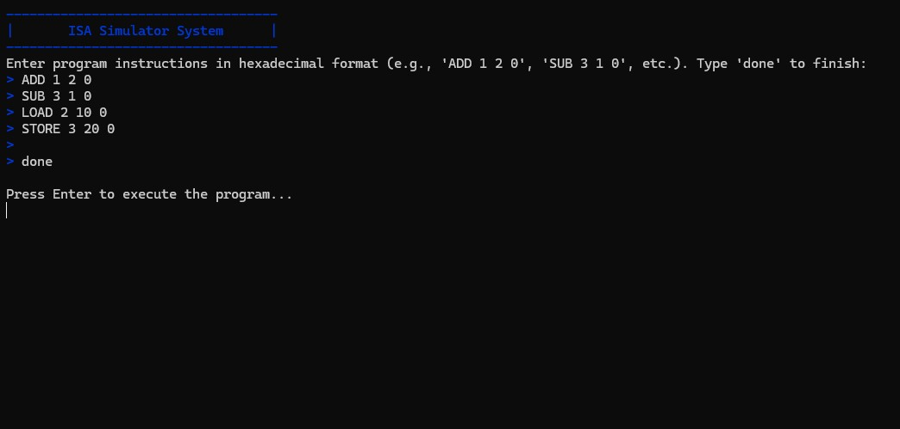
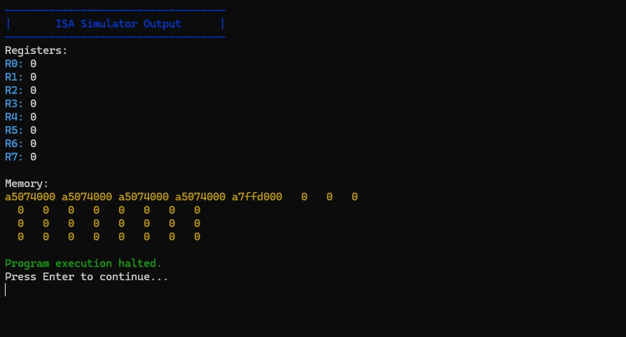

# ISA Simulator

A C++ program that simulates the execution of programs written in a custom instruction set architecture (ISA). This simulator allows users to load programs, execute instructions, and visualize the state of registers and memory during execution. It supports basic operations such as addition, subtraction, loading, and storing values, and provides an intuitive interface for understanding the behavior of programs in the simulated architecture.

## Screenshots

### Program Input


### Execution Output


## Features

- Simulates basic operations such as addition, subtraction, loading, and storing values
- Provides visualization of register and memory states during execution
- Supports user-defined programs through a simple instruction format

### Standard Version (`isa_simulator`)
- Basic command-line interface
- 256 memory locations
- Batch execution mode
- Pre-defined example program
- Hexadecimal memory display

### Interactive Version (`isa_simulator_interactive`)
- Enhanced teaching-focused interface
- Step-by-step execution with visual feedback
- 32 memory locations (optimized for display)
- Real-time user input and program control
- Clear visual state transitions
- Additional EXIT instruction support
- Comprehensive error handling
- Educational progress tracking

## Project Structure

```
isa-simulator/
├── src/                    # Source code
│   ├── isa_simulator.cpp       # Standard implementation (256 memory locations)
│   └── isa_simulator_interactive.cpp   # Interactive teaching version (32 memory locations)
├── bin/                    # Compiled executables
│   ├── isa_simulator.exe      # Standard version executable
│   └── isa_simulator_interactive.exe  # Interactive teaching version
├── examples/               # Sample programs and inputs
│   └── basic_program.txt      # Example instruction set
├── assets/                # Documentation assets
│   ├── demo-input.jpg        # Screenshot of program input interface
│   └── demo-output.jpg       # Screenshot of execution output
├── LICENSE                 # MIT License
└── README.md              # This file
```

## Usage

### Installation

1. Clone the repository to your local machine:
   ```bash
   git clone https://github.com/your-username/isa-simulator.git
   cd isa-simulator
   ```

### Building from Source

1. Using G++:
   ```bash
   # Standard version (256 memory locations, batch mode)
   g++ src/isa_simulator.cpp -o bin/isa_simulator
   
   # Interactive version (32 memory locations, teaching mode)
   g++ src/isa_simulator_interactive.cpp -o bin/isa_simulator_interactive
   ```

### Running the Simulator

#### Standard Version
```bash
./bin/isa_simulator
```
- Runs with a pre-defined example program
- Displays all steps at once
- Shows memory in hexadecimal format
- Suitable for batch processing

#### Interactive Version (Recommended for Learning)
```bash
./bin/isa_simulator_interactive
```
- Interactive program input
- Step-by-step execution with visual feedback
- Enhanced visual display with color-coding
- Clear state transitions between steps
- Ideal for learning and teaching

You can use the example program provided:
```bash
./bin/isa_simulator_interactive < examples/basic_program.txt
```

### Instruction Format
Both versions support the following instructions:
- `ADD dest src1 src2` - Add registers
- `SUB dest src1 src2` - Subtract registers
- `LOAD dest addr 0` - Load from memory
- `STORE src addr 0` - Store to memory
- `EXIT 0 0 0` - Halt program (interactive version only)

## Contributing

1. Fork the repository
2. Create a new branch (`git checkout -b feature/new-feature`)
3. Make your changes and commit them (`git commit -am 'Add new feature'`)
4. Push to the branch (`git push origin feature/new-feature`)
5. Create a new Pull Request

## License

This project is licensed under the [MIT License](LICENSE).

---

**Note:** This simulator is designed for educational purposes and may not cover all aspects of a real-world instruction set architecture.
